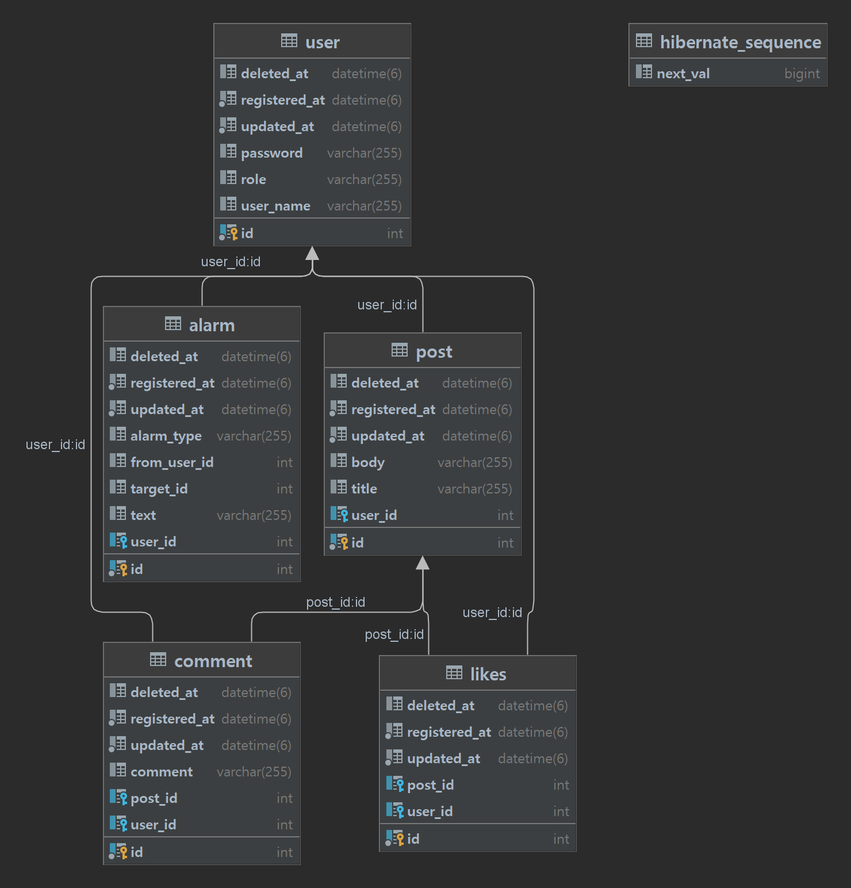
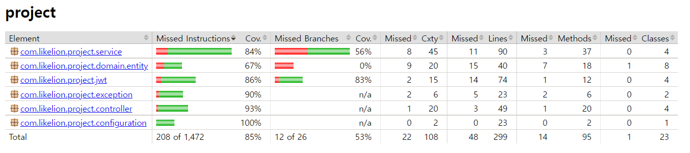

# MutsaSNS
**멋쟁이사자처럼 백엔드스쿨 2기 학생들의 학습 내용 정리를 위한 게시판**

## 요구사항
- [ ] Swagger
- [ ] AWS EC2에 Docker 배포
- [ ] Gitlab CI & Crontab CD
  - 프로젝트 업데이트 여부 확인 후 재배포 확인
  - Dockerfile, crontab 정상 작동 확인
- [ ] 회원가입
  - 중복가입 시 에러 처리
- [ ] 로그인
  - jwt 토큰 발급
- [ ] 포스트 작성, 수정, 삭제, 리스트
  - 조회는 모든 권한 가능, 리스트 조회는 20개 paging
  - 작성, 수정, 삭제는 회원만 가능
  - 회원만 가능한 기능에서의 인증 에러 확인
  - 삭제의 경우 soft delete 진행, `deleted_at`에 삭제 시간 저장
- [ ] 댓글 작성, 수정, 삭제, 리스트
  - 조회는 모든 권한 가능, 리스트 조회는 10개씩 paging
  - 작성, 수정, 삭제는 회원만 가능
  - 작성 시 알람 데이터 전송
- [ ] 좋아요 등록, 갯수 반환
  - 등록은 회원만 가능하며, 중복 좋아요 에러 처리
  - 갯수 반환은 모든 권한 가능
  - 좋아요 누를 시 알람 데이터 전송
- [ ] 알람 등록, 리스트
  - 알람은 댓글이나 좋아요 생성 시 자동 등록
  - 리스트 조회는 회원만 가능하며 20개씩 paging

## 개발 환경
- JAVA 11
- Editor : Intellij Ultimate
- Framework : SpringBoot 2.7.5
- Build : Gradle 7.5.1
- Server : AWS EC2
- Deploy : Docker
- DB : MySql 8.0
- Library : SpringBoot Web, MySQL, Spring Data JPA, Lombok, Spring Security, Swagger

## URL
> http://ec2-3-34-28-158.ap-northeast-2.compute.amazonaws.com:8080

## Swagger
> http://ec2-3-34-28-158.ap-northeast-2.compute.amazonaws.com:8080/swagger-ui/

## ERD


## Error Validation

```java
DUPLICATED_USER_NAME(HttpStatus.CONFLICT, "UserName이 중복됩니다."),
DUPLICATED_LIKE(HttpStatus.CONFLICT,"좋아요는 한 번만 누를 수 있습니다."),

INVALID_PASSWORD(HttpStatus.UNAUTHORIZED, "패스워드가 잘못되었습니다."),
INVALID_TOKEN(HttpStatus.UNAUTHORIZED, "잘못된 토큰입니다."),
TOKEN_NOT_FOUND(HttpStatus.UNAUTHORIZED, "토큰이 존재하지 않습니다."),
INVALID_PERMISSION(HttpStatus.UNAUTHORIZED, "사용자가 권한이 없습니다."),

USERNAME_NOT_FOUND(HttpStatus.NOT_FOUND,"Not founded"),
POST_NOT_FOUND(HttpStatus.NOT_FOUND, "해당 포스트가 없습니다."),
COMMENT_NOT_FOUND(HttpStatus.NOT_FOUND, "해당 댓글이 없습니다."),

DATABASE_ERROR(HttpStatus.INTERNAL_SERVER_ERROR, "DB에러"),
INVALID_VALUE(HttpStatus.BAD_REQUEST, "요청이 이상합니다.");
```
## TestCode

#### Jacoco 커버리지



| Controller Test          |                        |                                 |
|--------------------------|------------------------|---------------------------------|
| ***UserApiController***  |                        | |
| **등록**                   | 회원 가입 `성공` 테스트(1)          |                        | |
|                          | 회원 가입 `실패` 테스트(1)          | 중복 유저                  | |
|                          | 로그인 `성공` 테스트(1)            |                        | |
|                          | 로그인 `실패` 테스트(2)            | 유저 없음, 패스워드 불일치        | |
| ***PostApiController***  |                        | |
| **조회**                   | 포스트 상세 조회 `성공` 테스트(1)  | |
|                          | 포스트 리스트 조회 `성공` 테스트(1) | |
|                          | 마이 피드 조회 `성공` 테스트(1)   | |
|                          | 좋아요 갯수 조회 `성공` 테스트(1)  |
|                          | 마이 피드 조회 `실패` 테스트(1)   |로그인 하지 않은 경우|
|                          | 좋아요 갯수 조회 `실패` 테스트(1)  |포스트 없음|
| **등록**                   | 포스트 등록 `성공` 테스트(1)     | |
|                          | 좋아요 누르기 `성공` 테스트(1)    ||
|                          | 포스트 등록 `실패` 테스트(2)     | Beaerer 토큰 아닐 시, JWT가 유효하지 않은 경우|
|                          | 좋아요 누르기 `실패` 테스트(1)    |로그인 하지 않은 경우, 포스트 없음|
| **수정**                   | 포스트 수정 `성공` 테스트(1)     ||
|                          | 포스트 수정 `실패` 테스트(4)     |인증 실패, 포스트 없음, 작성자 불일치, 데이터베이스 에러|
| **삭제**                   | 포스트 삭제 `성공` 테스트(1)     ||
|                          | 포스트 삭제 `실패` 테스트(4)     | 인증 실패, 포스트 없음, 작성자 불일치, 데이터베이스 에러|
| ***CommentApiController***   |  |                        |
| **조회**                   | 댓글 리스트 조회 `성공` 테스트(1)  |  |
| **등록**                   | 댓글 작성 `성공` 테스트(1)      | |
|                          | 댓글 작성 `실패` 테스트(2)      |  로그인 하지 않은 경우, 포스트 없음|
| **수정**                   | 댓글 수정 `성공` 테스트(1)      |                                   |
|                          | 댓글 수정 `실패` 테스트(4)      | 인증 실패, 포스트 없음, 작성자 불일치, 데이터베이스 에러 |
| **삭제**                   | 댓글 삭제 `성공` 테스트(1)      |                                   |
|                          | 댓글 삭제 `실패` 테스트 (4)     | 인증 실패, 포스트 없음, 작성자 불일치, 데이터베이스 에러 |
| ***AlarmApiController*** |                        |
| **조회**                   | 알림 리스트 조회 `성공` 테스트(1)  |                                     |
|                          | 알림 리스트 조회 `실패` 테스트(1)  | 로그인 하지 않은 경우                        |

| Service Test       |                        |                                                                          |
|--------------------|------------------------|--------------------------------------------------------------------------|
| ***UserService***  |                        |
| 회원가입               | 회원가입 `성공` 테스트(1)       |                                                                          |
|                    | 회원가입 `실패` 테스트(1)       | 중복 유저                                                                    |
 | 로그인                | 로그인 `성공` 테스트(1) - 미완   |                                                                          |
|                    | 로그인 `실패` 테스트(2)        | 유저 없음, 패스워드 불일치                                                          |
| 권한 변경              | 권한 변경 `성공` 테스트(1)      |                                                                          |
 |                    | 권한 변경 `실패` 테스트(3)      | 유저 없음, 로그인 안함, 관리자 권한 유저가 아님                                             |
| ***PostService***  |                        |                                                                          |
| **조회**             | 포스트 리스트 조회 `성공` 테스트(1) |                                                                          |
|                    | 포스트 상세 조회 `성공` 테스트(1)  |                                                                          |
|                    | 마이 피드 조회 `성공` 테스트(1)   |                                                                          |
|                    | 좋아요 갯수 조회 `성공` 테스트(1)  |
|                    | 포스트 상세 조회 `실패` 테스트(1)  | 포스트 없음                                                                   |
|                    | 마이 피드 조회 `실패` 테스트(1)   | 유저 없음                                                                    |
|                    | 좋아요 갯수 조회 `실패` 테스트(1)  | 포스트 없음                                                                   |
| **등록**             | 포스트 등록 `성공` 테스트(1)     |                                                                          |
|                    | 좋아요 등록 `성공` 테스트(1)     |                                                                          |
|                    | 좋아요 등록 `실패` 테스트(3)     | 유저 없음, 포스트 없음, 이미 누른 좋아요                                                 |
| **수정**             | 포스트 수정 `성공` 테스트(1)     ||
|                    | 포스트 수정 `실패` 테스트(3)     | 포스트 없음, 작성자 유저 불일치, 유저 없음                                                |
| **삭제**             | 포스트 삭제 `성공` 테스트(1)     ||
|                    | 포스트 삭제 `실패` 테스트(3)     | 유저 없음, 포스트 없음, 작성자 유저 불일치                                                |
| ***CommentService***                   |  |                        |
| **조회**             | 댓글 리스트 조회 `성공` 테스트(1)  |                                                                          |
| **등록**             | 댓글 등록 `성공` 테스트(1)      |                                                                          |
|                    | 댓글 등록 `실패` 테스트(2)      | 유저 없음, 포스트 없음                                                            |
|                    | 댓글 등록 `실패` 테스트(2)      | 유저 없음, 포스트 없음                                                            |
|                    | 알람 등록 `성공` 테스트(1) - 미완 |                                                                          |
| **수정**             | 댓글 수정 `성공` 테스트(1)      |                                                                          |
|                    | 댓글 수정 `실패` 테스트(5)      | 유저 없음, 포스트 없음, 댓글 없음, 댓글 작성 유저와 수정 요청자의 불일치, 댓글이 달린 포스트와 수정 요청한 포스트의 불일치 |
| **삭제**             | 댓글 삭제 `성공` 테스트(1)      |                                                                          |
|                    | 댓글 삭제 `실패` 테스트 (5)     | 유저 없음, 포스트 없음, 댓글 없음, 댓글 작성 유저와 삭제 요청자의 불일치, 댓글이 달린 포스트와 삭제 요청한 포스트의 불일치 |
| ***AlarmService*** |                        |
| **조회**             | 알림 리스트 조회 `성공` 테스트(1)  |                                                                          |
|                    | 알림 리스트 조회 `실패` 테스트(1)  | 유저 없음                                                                    |


## EndPoint

`UserApiController.java`

| METHOD | URL                                         | Description                                    |
|--------|---------------------------------------------|------------------------------------------------|
| POST   | /api/v1/users/join                          | 회원가입                                        | 
| POST   | /api/v1/users/login                         | 로그인                                          |
| POST   | /api/v1/users/{userId}/role/change          | 회원 등급 변경(ADMIN 등급만 가능)                  | 

`PostApiController.java`

| METHOD | URL                                         | Description                                    |
|--------|---------------------------------------------|------------------------------------------------|
| GET    | /api/v1/posts                               | 포스트 리스트 조회                                | 
| GET    | /api/v1/posts/{postId}                      | 포스트 상세 조회                                 |
| POST   | /api/v1/posts                               | 포스트 생성                                      |
| PUT    | /api/v1/posts/{postId}                      | 포스트 수정                                      | 
| DELETE | /api/v1/posts/{postId}                      | 포스트 삭제                                      | 
| GET    | /api/v1/posts/my                            | 마이피드 조회                                    | 
| GET    | /api/v1/posts/{postsId}/likes               | 좋아요 개수 조회                                  |
| POST   | /api/v1/posts/{postsId}/likes               | 좋아요 누르기                                     | 

`CommentApiController.java`

| METHOD | URL                                         | Description                    |
|--------|---------------------------------------------|--------------------------------|
| GET    | /api/v1/posts/{postId}/comments             | 특정 포스트의 댓글 리스트 조회      | 
| POST   | /api/v1/posts/{postId}/comments             | 댓글 작성                        | 
| PUT    | /api/v1/posts/{postId}/comments/{commentId} | 댓글 수정                        | 
| DELETE | /api/v1/posts/{postId}/comments/{commentId} | 댓글 삭제                        | 

`AlarmApiController.java`

| METHOD | URL                                         | Description         |
|--------|---------------------------------------------|---------------------|
| GET    | /api/v1/alarms                              | 특정 유저의 알람 리스트 조회    | 


## 특이사항

### 1. Jacoco 코드 커버리지 적용

제일 공들인 부분이라고 할 수 있다.

테스트 코드를 작성하면서 내가 지금 작성하고 있는 테스트 코드가 실제 코드를 정확히 테스트 하고 있는지에 대한 의문이 들었다.

`Jacoco`라는 코드 커버리지 라이브러리를 통해, 내가 작성한 테스트 코드가 실제 코드를 얼마나 테스트 하는지를 확인할 수 있었다.

뿐만 아니라, Jacoco 리포트를 통해, 내가 분명히 테스트했다고 생각했던 부분들이 잘 진행되지 않는 상황을 맞닥뜨리면 내가 작성한 코드가
테스트 하기 어려운 코드일 수 도 있겠다는 생각을 했다.

그러면서 자연스럽게 코드 리팩토링 과정에 대한 생각을 할 수 있었고, 선순환 과정의 시작이었다고 생각한다.

분명 테스트 코드를 작성하는 것은 꽤나 고통스러운 작업이지만, 코드 커버리지 도구들을 활용하면 정확하게 테스트를 진행할 수 있으며, 이 과정은
다시 코드 리팩토링을 불러 일으킨다는 점에서 많은 것을 배울 수 있었다.

#### References

* [Gradle 프로젝트 Jacoco 적용하기](https://percyfrank.github.io/springboot/jacoco01/)

---

### 2. Jwt 토큰 Exception Handling

Security Filter는 스프링 영역 이전에 존재하기 때문에 @RestControllerAdvice로는 Security Filter에 대한 에러 처리를 할 수 없다.

기존의 Security Filter를 커스텀 한 `CustomAuthenticationEntryPoint`, `JwtTokenExceptionFilter`등을 통해 처리할 수 있었다.

추가적으로, 관리자 권한과 관련한 에러 처리는 아직 진행하지 못했지만, 비슷한 방법으로 진행할 예정이다.

#### References

* [JWT 토큰 예외처리(1) - 부적절한 토큰에 대한 예외처리](https://percyfrank.github.io/springboot/jwt/)
* [JWT 토큰 예외처리(2) - 토큰이 없는 경우](https://percyfrank.github.io/springboot/jwt02/)

---

### 3. Controller Test에 Security 포함하기

Controller 테스트를 진행하면서 Security가 포함되는 영역의 범위를 결정해야 했다.

아예 제외하거나, 부분적으로 포함하거나, 완전히 포함시키는 등의 3가지 방법이 있었고, 결과적으로는 포함시켜서 테스트틀 진행했다.

정확히 작동하는 테스트를 만들기 위해 많은 노력을 기울였고, 해당 방법을 찾기 위해 여러 사람들의 도움을 받았다.

최종적으로는, 직접 만든 `WebSecurityConfig`을 포함시키는 커스텀 `WebMvcTest` 어노테이션을 만들어서 진행했다.

#### References

* [Controller Test시 Security 포함 방법](https://percyfrank.github.io/springboot/Test03/)


