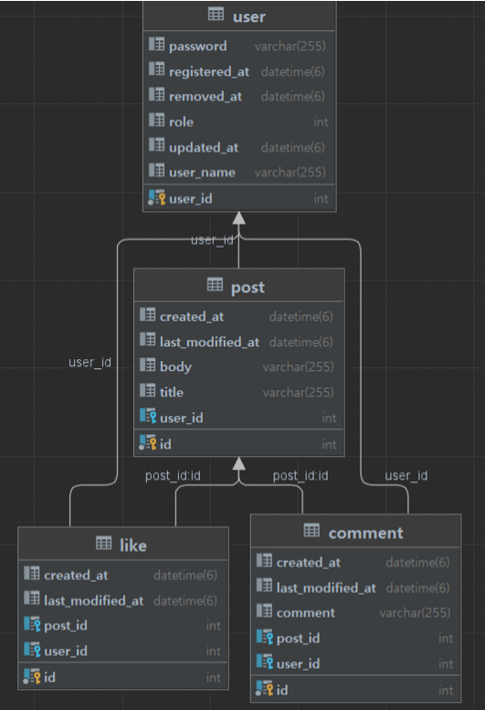

# MutsaSNS

## 멋쟁이사자처럼 백엔드스쿨 2기 학생들의 학습 내용 정리를 위한 게시판

## 요구사항
- [ ] Swagger
- [ ] 회원가입
- [ ] 로그인
- [ ] 포스트 작성, 수정, 삭제, 리스트
- [ ] AWS EC2에 Docker 배포
- [ ] Gitlab CI & Crontab CD

## URL
> http://ec2-3-34-28-158.ap-northeast-2.compute.amazonaws.com:8080

## Swagger
> http://ec2-3-34-28-158.ap-northeast-2.compute.amazonaws.com:8080/swagger-ui/

## ERD


## Error Validation

```java
DUPLICATED_USER_NAME(HttpStatus.CONFLICT, "UserName이 중복됩니다.")
USERNAME_NOT_FOUND(HttpStatus.NOT_FOUND,"Not founded")
INVALID_PASSWORD(HttpStatus.UNAUTHORIZED, "패스워드가 잘못되었습니다.")
INVALID_TOKEN(HttpStatus.UNAUTHORIZED, "잘못된 토큰입니다.")
INVALID_PERMISSION(HttpStatus.UNAUTHORIZED, "사용자가 권한이 없습니다.")
POST_NOT_FOUND(HttpStatus.NOT_FOUND, "해당 포스트가 없습니다.")
DATABASE_ERROR(HttpStatus.INTERNAL_SERVER_ERROR, "DB에러")
```


## Endpoint

### User

---

#### 회원가입
`POST /api/v1/join`

##### Request
```json
{
    "userName" : "권오석",
    "password" : "권오석1234"
}
```

##### Response
```json
{
    "resultCode": "SUCCESS",
    "result": {
        "userId": 1,
        "userName": "권오석"
    }
}
```


#### 로그인
`POST /api/v1/login`
##### Request
```json
{
    "userName" : "권오석",
    "password" : "권오석1234"
}
```
##### Response

```json
{
    "resultCode": "SUCCESS",
    "result": {
        "jwt": "String"
    }
}
```

<br>

### Post

---

#### 포스트 List
`GET /api/v1/posts`

##### Response
- 최신 순으로 page size = 20
```json
{
    "resultCode": "SUCCESS",
    "result": {
        "content": [
            {
                "id": 70,
                "title": "hello-new-title",
                "body": "hello-new-body",
                "userName": "kyeongrok37",
                "createdAt": "2022-12-27T01:24:46.694401"
            },
            {
                "id": 69,
                "title": "hello-new-title",
                "body": "hello-new-body",
                "userName": "kyeongrok36",
                "createdAt": "2022-12-27T01:05:24.967207"
            }
        ],
        "pageable": {
            "sort": {
                "empty": false,
                "sorted": true,
                "unsorted": false
            },
            "offset": 0,
            "pageNumber": 0,
            "pageSize": 20,
            "paged": true,
            "unpaged": false
        },
        "last": false,
        "totalPages": 4,
        "totalElements": 62,
        "size": 20,
        "number": 0,
        "sort": {
            "empty": false,
            "sorted": true,
            "unsorted": false
        },
        "first": true,
        "numberOfElements": 20,
        "empty": false
    }
}
```

#### 포스트 상세
`GET /api/v1/posts/{postsId}`
- id, 제목, 내용, 작성자, 작성날짜, 수정날짜
##### Response
```json
{
    "resultCode": "SUCCESS",
    "result": {
        "id": 31,
        "title": "hello-title",
        "body": "hello-body",
        "userName": "kyeongrok19",
        "createdAt": "2022-12-23T00:48:48.256048",
        "lastModifiedAt": "2022-12-23T00:48:48.256048"
    }
}
```

#### 포스트 등록
`POST /api/v1/posts`
##### Request
```json
{
    "title" : "게시글63",
    "body" : "게시글내용"
}
```
##### Response
```json
{
    "resultCode": "SUCCESS",
    "result": {
        "postId": 72,
        "message": "포스트 등록 완료"
    }
}
```
#### 포스트 수정
`PUT /api/v1/posts/{postsId}`
##### Request
```json
{
    "title" : "게시글19수정",
    "body" : "게시글내용"
}
```
##### Response
```json
{
    "resultCode": "SUCCESS",
    "result": {
        "postId": 19,
        "message": "포스트 수정 완료"
    }
}
```
#### 포스트 삭제
`DELETE /api/v1/posts/{postsId}`
##### Response
```json
{
    "resultCode": "SUCCESS",
    "result": {
        "postId": 1,
        "message": "포스트 삭제 완료"
    }
}
```

